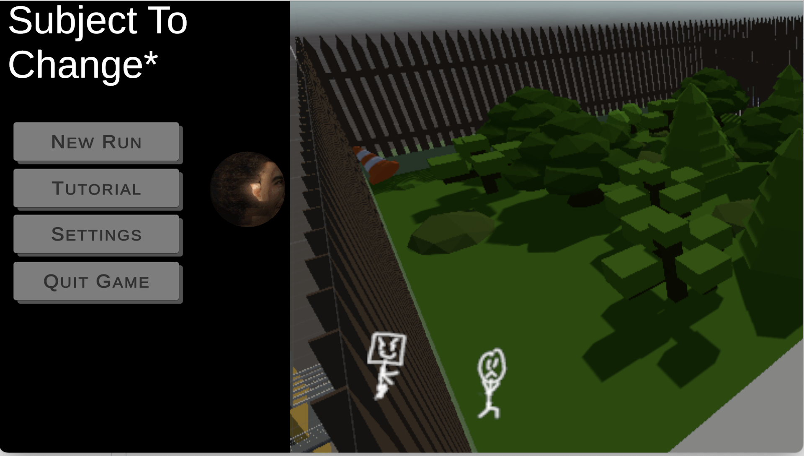

# Our Game

Subject to Change is a one-of-a-kind nightmarish parkour game developed by LeapForge. The game features a dynamic movement system that offers high-octane gameplay complemented by a randomly generated map to enhance replayability and immerse yourself in a nightmare.

# Trailer

<video width="640" height="360" controls>
  <source src="img/StCtrailer.mp4" type="video/mp4">
</video>

# Screenshots

# Future Goals

We plan on changing anything that does not fit the overall aesthetic of our game. As stated before, the theme is an almost nightmarish vibe. One criticism that we got was that the arms did not fit that aesthetic. We're looking into changing the brightness or the skin tone of the arms and possibly changing the atmosphere to fit with our narrative.   
